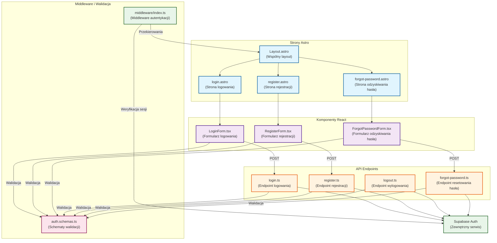

# Diagram architektury UI - Moduł autentykacji

## Analiza architektury

### 1. Komponenty systemu

#### Strony Astro

- `login.astro` - Strona logowania
- `register.astro` - Strona rejestracji
- `forgot-password.astro` - Strona odzyskiwania hasła
- `Layout.astro` - Wspólny layout dla wszystkich stron

#### Komponenty React

- `LoginForm.tsx` - Interaktywny formularz logowania
- `RegisterForm.tsx` - Interaktywny formularz rejestracji
- `ForgotPasswordForm.tsx` - Interaktywny formularz odzyskiwania hasła

#### Endpointy API

- `login.ts` - Obsługa logowania
- `register.ts` - Obsługa rejestracji
- `logout.ts` - Obsługa wylogowania
- `forgot-password.ts` - Obsługa resetowania hasła

#### Middleware i walidacja

- `middleware/index.ts` - Middleware autentykacji
- `auth.schemas.ts` - Schematy walidacji formularzy

### 2. Przepływ danych

- Formularze React -> Endpointy API -> Supabase Auth
- Middleware -> Supabase Auth -> Context użytkownika
- Schematy walidacji -> Formularze i API

### 3. Funkcjonalność komponentów

- **Formularze**: zarządzanie stanem, walidacja, komunikacja z API
- **Strony Astro**: SSR, routing, layout
- **Middleware**: autentykacja, sesje, przekierowania
- **API**: obsługa żądań, walidacja, komunikacja z Supabase

## Diagram architektury

## Legenda

1. **Kolory i style**
   - Niebieski (:::page) - Strony Astro
   - Fioletowy (:::component) - Komponenty React
   - Pomarańczowy (:::api) - Endpointy API
   - Zielony (:::service) - Serwisy i middleware
   - Różowy (:::schema) - Schematy walidacji

2. **Typy połączeń**
   - Strzałki ciągłe (-->) - Bezpośrednie zależności
   - Strzałki z etykietami (--|"tekst"|->) - Opisane interakcje

3. **Grupowanie**
   - Subgrafy grupują powiązane komponenty według ich typu i funkcji

## Opis architektury

1. **Warstwa prezentacji**
   - Layout.astro zapewnia spójny wygląd wszystkich stron
   - Strony Astro renderują się po stronie serwera (SSR)
   - Komponenty React zapewniają interaktywność po stronie klienta

2. **Warstwa logiki**
   - Formularze React zarządzają stanem i walidacją
   - API obsługuje żądania i komunikację z Supabase
   - Middleware kontroluje dostęp i sesje użytkowników

3. **Warstwa danych**
   - Supabase Auth zarządza autentykacją i sesjami
   - Schematy walidacji zapewniają spójność danych

4. **Przepływ danych**
   - Od formularzy przez API do Supabase
   - Od middleware przez Supabase do kontekstu aplikacji
   - Dwukierunkowa walidacja (client i server)
